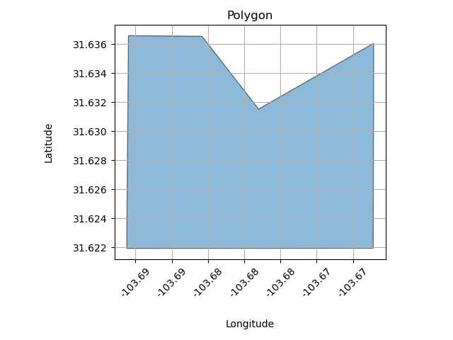
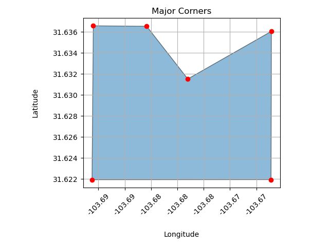
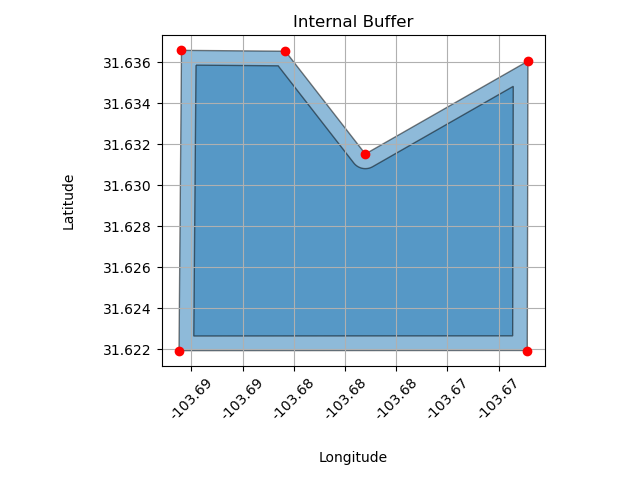
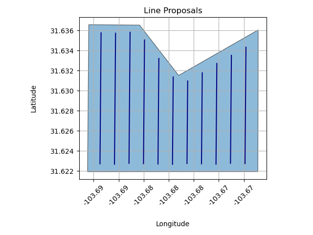
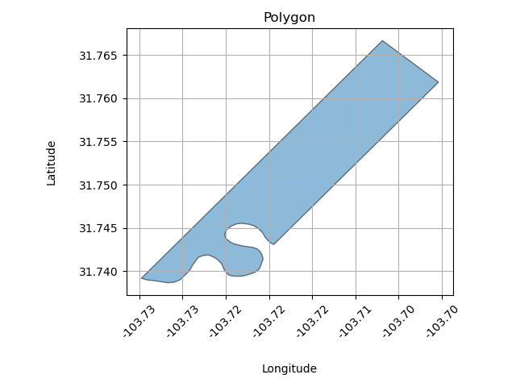
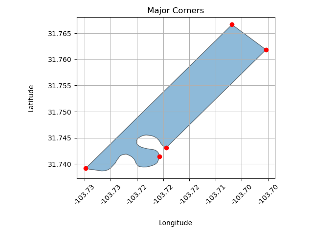
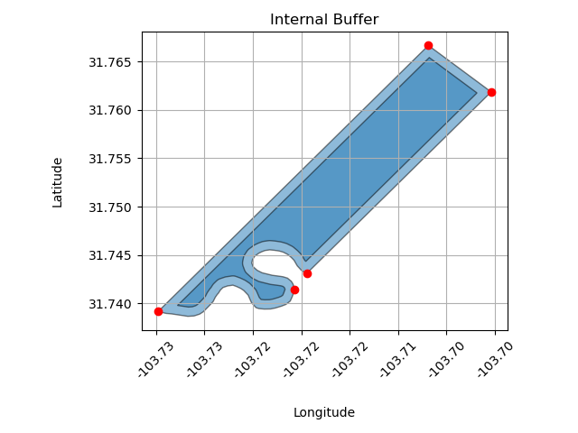
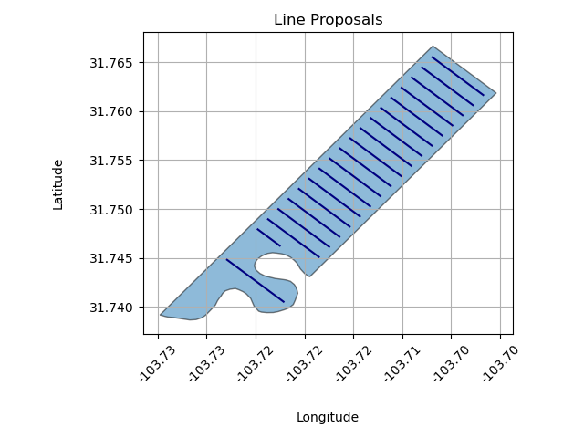
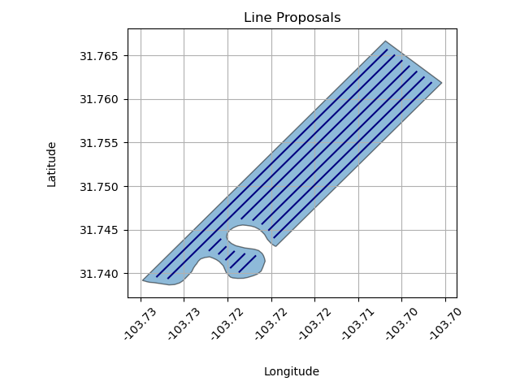

# Polygon-Proposal-Algo

Python3 algorithm that proposes linestring locations within an arbitrary-shaped polygon. 

Proposals account for user-specified constraints, including:
- `orientation`: desired cardinal
- `min_len`: minimum linestring length, below which proposals are dropped
- `spacing`: minimum distance between adjacent proposed linestrings
- `min_edge_spacing`: minimum distance proposed linestrings must maintain away from polygon exterior

Beyond above constraints, algorithm maximizes linestring count and length.

Starter demo data (shapefile) included for convenience.

Note: `adjustment_factor` needs to be used when centering linestrings within polygon, or when handling irregular-shaped polygons with custom linestring spacing requirements.

Note: demo data and images are arbitrarily wrt latitude/longitude.

# Algorithm
0. Pre-processing of polygons
1. Extract critical corners from polygon
2. Apply reverse buffer, respecting `min_edge_spacing`
3. Propose linestrings within buffered polygon wrt critical edge, respecting `spacing`

# Example 1 (polygon ID 21)

|   | 
|:--:| 
| Raw Polygon |

|   | 
|:--:| 
| Critical Corners |

|   | 
|:--:| 
| Internal Buffer |

|   | 
|:--:| 
| Proposals, Orientation = 0&deg; |

|   | 
|:--:| 
| Proposals, Orientation = 90&deg; |

# Example 2 (polygon ID 31)

|   | 
|:--:| 
| Raw Polygon |

|   | 
|:--:| 
| Critical Corners |

|   | 
|:--:| 
| Internal Buffer |

|   | 
|:--:| 
| Proposals, Orientation = 135&deg; |

|   | 
|:--:| 
| Proposals, Orientation = 45&deg;, Spacing = 300, MinLen = 100 |

|   | 
|:--:| 
| Proposals, Orientation = 45&deg;, Spacing = 200, MinLen = 0   <em> (note tighter spacing density and inclusion of   shorter linestring proposals, as compared to above) </em> |

